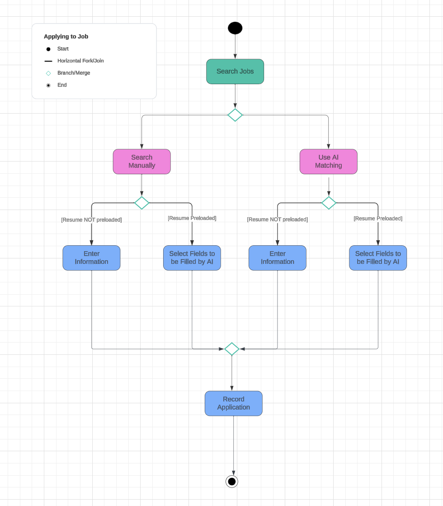
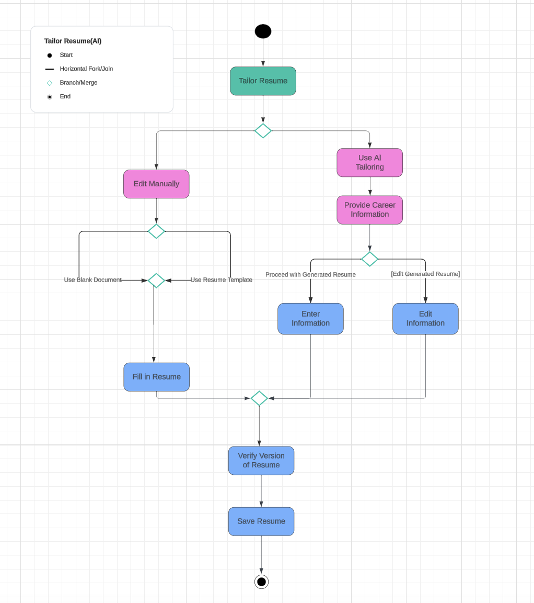

# Specification Phase Exercise

A little exercise to get started with the specification phase of the software development lifecycle. See the [instructions](instructions.md) for more detail.

## Team members

Christina Borao: [Github](https://github.com/crb623)

Ellis Pinsky: [Github](https://github.com/ellispinsky)

Sang In (Harry) Kang: [Github](https://github.com/Sik247)

Corina Luca: [Github](https://github.com/CorinaLucaFocsan)

## Stakeholders

See instructions. Delete this line and replace with the name(s) of the stakeholder(s) you interviewed and lists showing their goals/needs, and problems/frustrations.

## Product Vision Statement

See instructions. Delete this line and place your Product Vision Statement here.

## User Requirements
1. `As a new user, I want to provide necessary information like a username, email, and password so that I can create a new account.`
2. `As a new user, I want to sign up using my existing Google account so that I don't have to keep track of another account.`
3. `As a new user, I want a verification email to be sent to the address I provided so that I can ensure the security of my account.`
4. `As a new user, I want to provide information such as my resume, educational information, work experience, skills, and career interests so that I can be matched to jobs that I find interesting and that I meet most of the qualifications for.`
5. `As a new user, I want to have the option of my resume being parsed so I don't have to spend more time manually entering all the information.`
6. `As a new user, I want to be guided through a brief platform tutorial so that I can discover the highlights of this application and how it can help me with my job search.`
7. `As a user, I want to be able to edit my job preferences, skills, and work experience so that it accurately reflects my skill set and career interests at all times.`
8. `As a user, I want to receive mobile notifications so that I can get relevant application updates and reminders of upcoming deadlines whenever I'm on the go.`
9. `As a user, I want to be able to look up specific roles so that I can find the closest match to positions I would look forward to applying to.`
10. `As a user, I want to be able to consult the description, location, pay, company name, and qualifications of each role so that I can decide whether this internship is a good fit for me.`
11. `As a user, I want to be redirected to apply to the positions I am interested in through an "apply" button so that I can start submitting applications to these roles.`
12. `As a user, I want the platform to mark when I applied to a position so that I can track my progress and avoid submitting multiple applications to the same role.`
13. `As a user, I want to access a dashboard that tracks all my applications so that I can keep track of the total number of applications submitted, what the names of these roles are, at what company, and how far along I am in each process.`
14. `As a user, I want to write cold emails for roles I am interested in using AI so that I can receive support as I attempt to expand my network, helping my internship application journey and my confidence as an applicant.`

## Activity Diagrams

User Story #1 - Applying To jobs

User Story #2 

## Wireframe
https://excalidraw.com/#json=-bwTEwJIS3kKtmOawn92m,kuQpEw3y3Cmdtoy7dcG1SQ

## Clickable Prototype

[Clickable Figma Prototype](https://www.figma.com/proto/7qrDYUCburrZNrgHaV0Gag/Internship-Insight---SWE-with-Bloomberg?type=design&node-id=1-3&t=ay0Td5s12n5yTs0u-1&scaling=scale-down&page-id=0%3A1&starting-point-node-id=1%3A3&mode=design)
